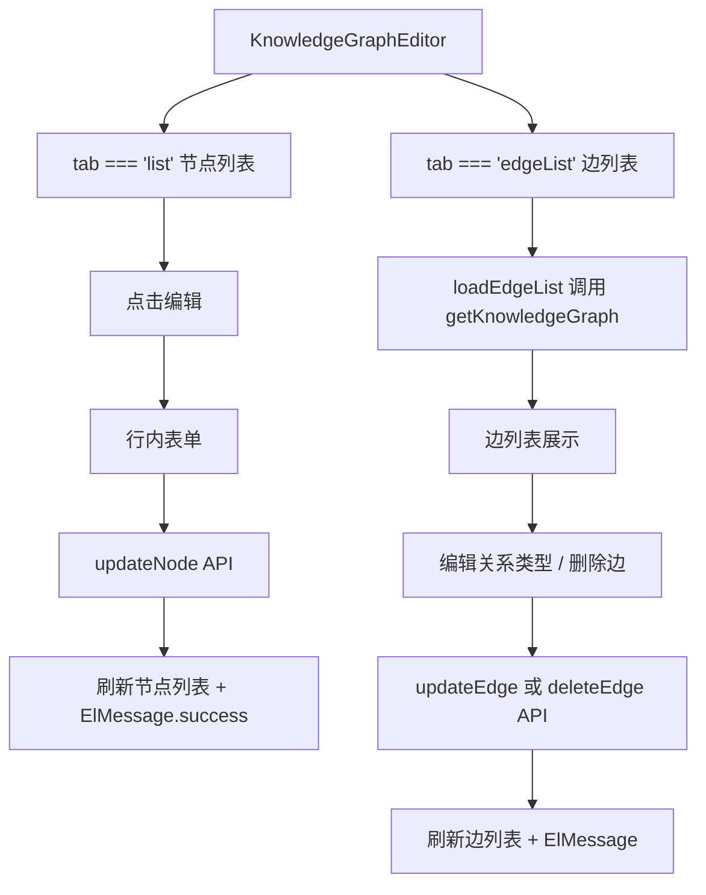

## 用户需求

为知识图谱编辑器增加节点和边的编辑功能，使前端 UI 与已有的后端 CRUD API 对齐。

## 功能内容

1. **节点编辑**：在节点列表 tab 中，每个节点行增加"编辑"按钮，点击后弹出编辑表单（复用新增节点的表单结构），修改名称、类型、重要度、描述后提交，调用 `updateNode()` API。
2. **边管理**：新增"边列表"tab，展示当前课程所有边，支持编辑（修改关系类型）和删除。
3. **前端 API 补全**：`knowledge.ts` 已有 `updateNode`、`updateEdge`、`deleteEdge` 函数，需确保在编辑器中正确导入和使用。

## 视觉效果

- 节点列表中每个节点行增加"编辑"按钮（铅笔图标或文字），点击后_inline编辑或弹出编辑表单。
- 新增"边列表"tab 按钮，与其他 tab 并列。
- 边列表中每条边显示源节点、目标节点、关系类型，以及"编辑"和"删除"按钮。
- 编辑操作用 inline 行内编辑方式（点击编辑后该行变为可编辑状态），保持 UI 简洁。

## 技术栈

- 前端：Vue 3（Composition API + `<script setup>`）、TypeScript、Element Plus
- 后端：Python + FastAPI（已有 PUT/DELETE 接口，无需修改）

## 实现方案

### 修改文件清单

| 文件 | 操作 | 说明 |
| --- | --- | --- |
| `frontend/src/components/knowledge/KnowledgeGraphEditor.vue` | 修改 | 增加节点编辑功能、边列表/编辑/删除功能、导入缺失的 API 函数 |
| `frontend/src/api/knowledge.ts` | 无需修改 | 已有 `updateNode`、`updateEdge`、`deleteEdge` 函数 |


### 前端 API 层现状

`knowledge.ts` 已有以下函数，可直接使用：

- `updateNode(courseId, nodeId, payload)` — PUT `/courses/{id}/knowledge-graph/nodes/{nodeId}`
- `updateEdge(courseId, edgeId, payload)` — PUT `/courses/{id}/knowledge-graph/edges/{edgeId}`
- `deleteEdge(courseId, edgeId)` — DELETE `/courses/{id}/knowledge-graph/edges/{edgeId}`
- `getKnowledgeGraph(courseId)` — 返回 `{ nodes, edges, layout_config }`，edges 已包含在响应中

### KnowledgeGraphEditor.vue 修改详情

#### 1. 导入补全

在 `<script setup>` 的 import 语句中，增加导入：

- `updateNode`、`updateEdge`、`deleteEdge`（来自 `@/api/knowledge`）
- `NodeUpdatePayload`、`EdgeUpdatePayload`（类型）

#### 2. Tab 类型扩展

将 `tab` 的类型从 `'node' | 'edge' | 'list' | 'preset'` 扩展为：

```
'typeof tab' = 'node' | 'edge' | 'list' | 'edgeList' | 'preset'
```

在模板的 tabs 区域增加第 5 个按钮："边列表"。

#### 3. 节点编辑功能（修改节点列表 tab）

在节点列表 `v-for` 的每行中增加"编辑"按钮。点击编辑时：

- 将该节点设为"编辑中"状态（`editingNodeId` ref）
- 该行变为可编辑表单（名称、类型、重要度、描述）
- 显示"保存"和"取消"按钮
- 保存时调用 `updateNode()`，成功后退出编辑状态并刷新列表

具体实现：

- 新增 `editingNodeId` ref（`number | null`）
- 新增 `editNodeForm` reactive 对象（复用 `NodeUpdatePayload` 结构）
- `handleEditNode(node)` — 将节点数据填入表单，设置 `editingNodeId`
- `handleSaveNodeEdit()` — 调用 `updateNode()`，处理成功/失败
- `cancelNodeEdit()` — 清空编辑状态

#### 4. 边列表/编辑/删除功能（新增 edgeList tab）

新增完整的边管理 UI：

- `edgeList` ref（存储边数据，需从 `getKnowledgeGraph` 响应中提取 edges 并附带节点名称）
- `edgeListLoading`、`edgeListMsg`、`edgeListErr` ref
- `loadEdgeList()` — 调用 `getKnowledgeGraph()`，将 edges 与 nodes 做 join，得到每条边的源节点名称和目标节点名称
- `editingEdgeId` ref — 当前正在编辑的边 ID
- `editEdgeForm` reactive — `{ relation_type: string }`
- `handleEditEdge(edge)` — 进入编辑状态
- `handleSaveEdgeEdit()` — 调用 `updateEdge()`
- `handleDeleteEdge(edgeId)` — 用 `ElMessageBox.confirm` 确认后调用 `deleteEdge()`

边的数据结构说明：后端返回的 edge 只有 `source_node_id` 和 `target_node_id`，需要在前端做 join 显示节点名称。在 `loadEdgeList()` 中：

```typescript
const { data } = await getKnowledgeGraph(props.courseId)
const nodeMap = new Map(data.nodes.map((n: any) => [n.id, n.name]))
edgeList.value = (data.edges || []).map((e: any) => ({
  ...e,
  sourceName: nodeMap.get(e.source_node_id) || e.source_node_id,
  targetName: nodeMap.get(e.target_node_id) || e.target_node_id,
}))
```

#### 5. 模板修改

- tabs 区域：增加 `<button :class="{ active: tab === 'edgeList' }" @click="tab = 'edgeList'; loadEdgeList()">边列表</button>`
- 节点列表 `v-for` 的每行：增加编辑按钮和 inline 编辑表单
- 新增边列表 tab 的模板块 `v-if="tab === 'edgeList'"`

#### 6. 样式修改

新增边列表相关样式（参考节点列表样式）：

- `.kge-edge-row` — 边行布局
- `.kge-edge-edit` — 行内编辑状态样式
- 编辑/删除按钮样式

### 数据流



### 注意事项

1. **边删除的后端行为**：后端 `DELETE /edges/{id}` 只删除边，不影响节点，前端调用后只需从 `edgeList` 中移除该项。
2. **节点编辑的 UI 方式**：采用行内编辑（inline edit），而非弹窗，以保持与删除操作一致的 UX 密度。
3. **边列表加载**：边数据不包含节点名称，需要在前端将 `edges` 与 `nodes` 做关联查询（前端 join）。
4. **导入检查**：`KnowledgeGraphEditor.vue` 当前未导入 `updateNode`、`updateEdge`、`deleteEdge`，需在 script 中补全。

## 设计风格

在现有 `KnowledgeGraphEditor.vue` 的 UI 基础上进行增量设计，保持与现有风格一致：

- 整体采用简洁的面板式布局，与现有 tabs + form + list 风格统一
- 节点编辑采用行内编辑（inline edit），不弹窗，保持上下文连贯
- 边列表采用与节点列表一致的列表风格
- 所有操作均有 `ElMessage` 反馈

## 页面结构设计

### 知识图谱编辑器（KnowledgeGraphEditor）

编辑器是一个可折叠面板，内部有 5 个 tab：

#### Tab 1：新增节点（已有，不修改）

- 表单：名称、类型、重要度、描述、提交按钮

#### Tab 2：新增边（已有，不修改）

- 表单：源节点下拉、目标节点下拉、关系类型下拉、提交按钮

#### Tab 3：节点列表（修改，增加编辑功能）

- 列表每行显示：节点名称、类型、重要度、[编辑]按钮、[删除]按钮
- 点击[编辑]后，该行变为可编辑状态：
- 名称 → input
- 类型 → select
- 重要度 → number input
- 描述 → textarea（简短）
- [保存] [取消] 按钮
- 编辑状态同时只能有一行

#### Tab 4：边列表（新增）

- 列表每行显示：源节点名称 → 关系类型 → 目标节点名称、[编辑]按钮、[删除]按钮
- 点击[编辑]后，关系类型变为 select 下拉，显示 [保存] [取消]
- 删除操作需要 `ElMessageBox.confirm` 确认

#### Tab 5：保存为预设（已有，不修改）

- 表单：预设名称、描述、提交按钮

## Agent Extensions

### SubAgent

- **code-explorer**
- Purpose: 在修改 `KnowledgeGraphEditor.vue` 时，确认 `updateNode`、`updateEdge`、`deleteEdge` 在 `knowledge.ts` 中的精确签名，以及 `getKnowledgeGraph` 返回的 edge 数据结构中是否包含节点名称
- Expected outcome: 确认 API 函数签名和返回数据结构，确保编辑功能的实现与现有 API 完全对齐