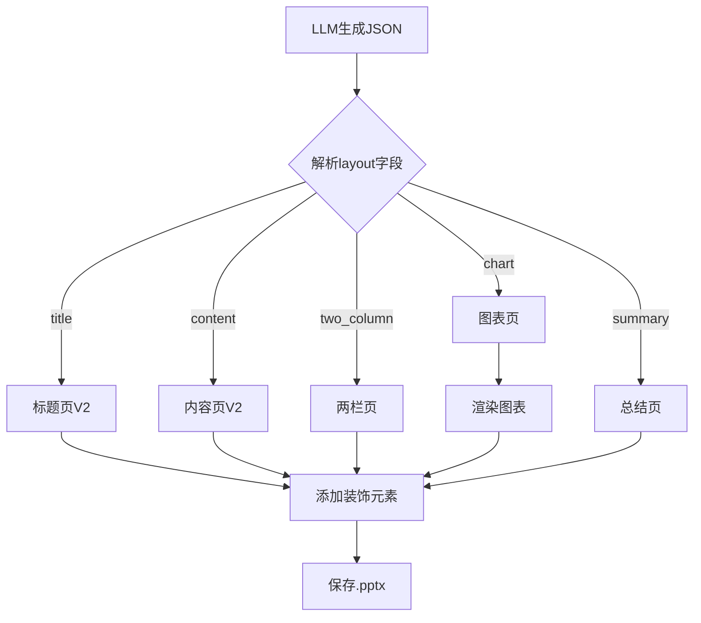

## 用户需求

改进 PPT 生成功能，使 PPT 内容更加丰富，包含图表、排版不单一、还有丰富的图标。

## 产品概述

将当前 PPT 生成器从单一的"学术蓝"风格升级为**插画风格**，支持多种幻灯片布局（标题页、内容页、两栏页、图表页、总结页），并在幻灯片中插入装饰性图标和形状，使 PPT 视觉效果更丰富、更有设计感。

## 核心功能

- **插画风格配色**：温暖活泼的配色方案（主色温暖橙/绿，辅以柔和的渐变和圆角元素）
- **多种幻灯片布局**：通过 LLM 输出的 `layout` 字段支持 title（标题页）、content（内容页）、two_column（两栏页）、chart（图表页）、summary（总结页）五种布局
- **图表支持**：在 `layout=chart` 时，根据 LLM 输出的图表数据渲染柱状图、饼图、折线图
- **装饰图标**：在各类布局中插入插画风格的装饰形状（手绘风线条、圆形装饰、图标形状）
- **丰富排版**：两栏布局支持左右分栏，图表页支持图表+文字说明组合

## 技术栈

- 后端：Python + FastAPI + python-pptx 0.6.23
- 图表：python-pptx 内置图表支持（`pptx.chart.data`、`pptx.enum.chart`）
- 形状装饰：python-pptx 形状绘制（手绘风曲线、椭圆形、圆角矩形）

## 实现方案

### 核心思路

1. **修改 Prompt**：让 LLM 输出包含 `layout` 和 `chart` 字段的丰富 JSON 结构
2. **新增布局函数**：为每种 `layout` 类型实现专门的幻灯片绘制函数
3. **新增图表绘制**：使用 python-pptx 的图表 API 渲染柱状图、饼图、折线图
4. **新增装饰元素**：在每页添加插画风格装饰（手绘风曲线、圆形、图标形状）

### 修改文件清单

| 文件 | 操作 | 说明 |
| --- | --- | --- |
| `backend/app/generator/modal/ppt_generator.py` | 大幅修改 | 改造配色、Prompt、布局函数、图表函数、装饰函数 |


### 详细修改

#### 1. 配色方案（插画风格）

替换当前的学术蓝配色，改为温暖插画风格：

```python
# 插画风格配色 — 温暖、活泼
_COLOR_PRIMARY = RGBColor(0xFF, 0x8C, 0x42)       # 温暖橙（主色）
_COLOR_PRIMARY_LIGHT = RGBColor(0xFF, 0xBF, 0x80)  # 浅橙
_COLOR_SECONDARY = RGBColor(0x4E, 0xC9, 0x7A)      # 清新绿（辅助色）
_COLOR_ACCENT = RGBColor(0xFF, 0xE0, 0xB2)          # 温暖米色（强调色）
_COLOR_BG = RGBColor(0xFF, 0xF8, 0xF0)              # 暖白背景
_COLOR_TEXT = RGBColor(0x3D, 0x2C, 0x2C)            # 深棕文字
_COLOR_TEXT_LIGHT = RGBColor(0x8B, 0x7E, 0x7E)      # 浅棕文字
_COLOR_WHITE = RGBColor(0xFF, 0xFF, 0xFF)
```

#### 2. 修改 Prompt（`_PPT_SYSTEM`）

让 LLM 输出包含 `layout` 和 `chart` 的 JSON：

```
{
  "title": "课件标题",
  "slides": [
    {
      "layout": "title",
      "title": "标题页"
    },
    {
      "layout": "content",
      "title": "概念讲解",
      "bullets": ["要点1", "要点2"],
      "notes": "讲稿..."
    },
    {
      "layout": "two_column",
      "title": "对比分析",
      "left_title": "概念A",
      "left_bullets": ["要点1", "要点2"],
      "right_title": "概念B",
      "right_bullets": ["要点1", "要点2"],
      "notes": "讲稿..."
    },
    {
      "layout": "chart",
      "title": "数据分析",
      "chart": {
        "type": "bar",
        "title": "成绩分布",
        "categories": ["A", "B", "C"],
        "series": [{"name": "分数", "values": [90, 85, 92]}]
      },
      "bullets": ["结论1", "结论2"],
      "notes": "讲稿..."
    },
    {
      "layout": "summary",
      "title": "本章总结",
      "bullets": ["总结1", "总结2"],
      "notes": "讲稿..."
    }
  ]
}
```

Prompt 修改要点：

- 在"输出格式"部分，详细说明五种 `layout` 类型的结构和用途
- 鼓励 LLM 根据教学内容选择合适的布局（概念多→content，对比→two_column，数据→chart，回顾→summary）
- 图表数据要求：`type` 可选 `bar`（柱状图）、`pie`（饼图）、`line`（折线图）

#### 3. 新增布局绘制函数

在 `PPTGenerator` 类中新增以下函数：

- `_add_title_slide_v2()` — 插画风格标题页（温暖渐变背景 + 大圆形装饰 + 手绘风波浪）
- `_add_content_slide_v2()` — 插画风格内容页（暖白背景 + 彩色标题卡片 + 图标装饰）
- `_add_two_column_slide()` — 两栏布局（左右分栏，每栏有彩色标题条）
- `_add_chart_slide()` — 图表页（左侧图表 + 右侧要点说明）
- `_add_summary_slide()` — 总结页（中心放射状要点布局）

#### 4. 新增图表绘制函数

```python
def _add_chart(self, slide, chart_data: dict, left, top, width, height):
    """在幻灯片上绘制图表"""
    from pptx.chart.data import CategoryChartData
    from pptx.enum.chart import XL_CHART_TYPE
    
    cd = CategoryChartData()
    cd.categories = chart_data["categories"]
    for series in chart_data["series"]:
        cd.add_series(series["name"], series["values"])
    
    chart_type_map = {
        "bar": XL_CHART_TYPE.COLUMN_CLUSTERED,
        "pie": XL_CHART_TYPE.PIE,
        "line": XL_CHART_TYPE.LINE,
    }
    chart_type = chart_type_map.get(chart_data["type"], XL_CHART_TYPE.COLUMN_CLUSTERED)
    slide.shapes.add_chart(chart_type, left, top, width, height, cd)
```

#### 5. 新增装饰元素函数

```python
def _add_illustration_decor(self, slide, decor_type="circle"):
    """添加插画风格装饰元素"""
    # 手绘风波浪（用曲线形状模拟）
    # 圆形装饰（半透明，多层叠加）
    # 图标形状（用形状组合模拟简单图标）
```

#### 6. 修改 `_export_pptx()` 调度逻辑

```python
def _export_pptx(self, content, ...):
    for idx, slide_data in enumerate(slides):
        layout = slide_data.get("layout", "content")
        if idx == 0 or layout == "title":
            self._add_title_slide_v2(prs, slide_data, chapter_title)
        elif layout == "content":
            self._add_content_slide_v2(prs, slide_data, ...)
        elif layout == "two_column":
            self._add_two_column_slide(prs, slide_data, ...)
        elif layout == "chart":
            self._add_chart_slide(prs, slide_data, ...)
        elif layout == "summary":
            self._add_summary_slide(prs, slide_data, ...)
        else:
            self._add_content_slide_v2(prs, slide_data, ...)
```

### 数据流



### 注意事项

1. **向后兼容**：LLM 可能不总是输出 `layout` 字段，需要有默认值（`default="content"`）
2. **图表数据验证**：LLM 输出的图表数据可能不完整，需要异常处理
3. **python-pptx 图表限制**：图表样式较简单，可通过设置图表颜色来匹配插画风格
4. **装饰元素不过度**：装饰应适度，不遮挡正文内容
5. **`_fallback_content()` 也需要更新**：添加 `layout` 字段，使降级内容也能使用新布局

## 设计风格

采用**插画风格（Illustration Style）**设计 PPT 模板，整体视觉效果温暖、活泼、有设计感。

### 风格关键词

温暖、手绘风、圆角、渐变、活泼配色、装饰元素

### 配色方案

- **主色**：温暖橙 `#FF8C42`
- **辅助色**：清新绿 `#4EC97A`、浅橙 `#FFBF80`
- **背景色**：暖白 `#FFF8F0`
- **文字色**：深棕 `#3D2C2C`、浅棕 `#8B7E7E`
- **强调色**：温暖米色 `#FFE0B2`、浅黄 `#FFF3CD`

### 页面设计

#### 标题页（title）

- 全屏温暖渐变背景（橙→浅橙→米色）
- 中心大圆形装饰（半透明，多层叠加，插画感）
- 标题使用大号圆润字体，居中
- 底部有手绘风格波浪装饰线

#### 内容页（content）

- 暖白背景
- 顶部彩色标题卡片（圆角矩形，橙色渐变）
- 左侧有绿色竖条装饰
- 要点列表前有大圆形数字图标（1、2、3...）
- 右下角有小型插画装饰（简单形状组合）

#### 两栏页（two_column）

- 左右分栏，每栏占约 45% 宽度
- 左栏标题条用橙色，右栏用绿色
- 每栏内容区域有浅色背景卡片
- 中间有插画风格分隔装饰

#### 图表页（chart）

- 左侧 55% 区域放图表（柱状图/饼图/折线图）
- 右侧 40% 区域放要点说明
- 图表区域有浅色背景卡片
- 图表配色使用插画风格配色方案

#### 总结页（summary）

- 暖白背景
- 中心放射状布局（要点围绕中心标题排列）
- 每个要点用彩色圆形图标包裹
- 底部有"谢谢"或"思考题"区域

### 交互与动画

- PPT 本身不支持动画（导出为 .pptx），但可以在 PowerPoint 中手动添加
- 重点是通过视觉效果（配色、形状、布局）营造插画感

### 响应式

- 幻灯片尺寸固定为 16:9（13.333" × 7.5"）
- 所有元素使用绝对定位，确保布局稳定

## Agent Extensions

### Skill

- **pptx**
- Purpose: 在处理 .pptx 文件时提供专业的 python-pptx 操作指导，包括图表绘制、形状操作、布局设计等
- Expected outcome: 确保图表和装饰元素的代码实现正确、高效，符合 python-pptx 最佳实践