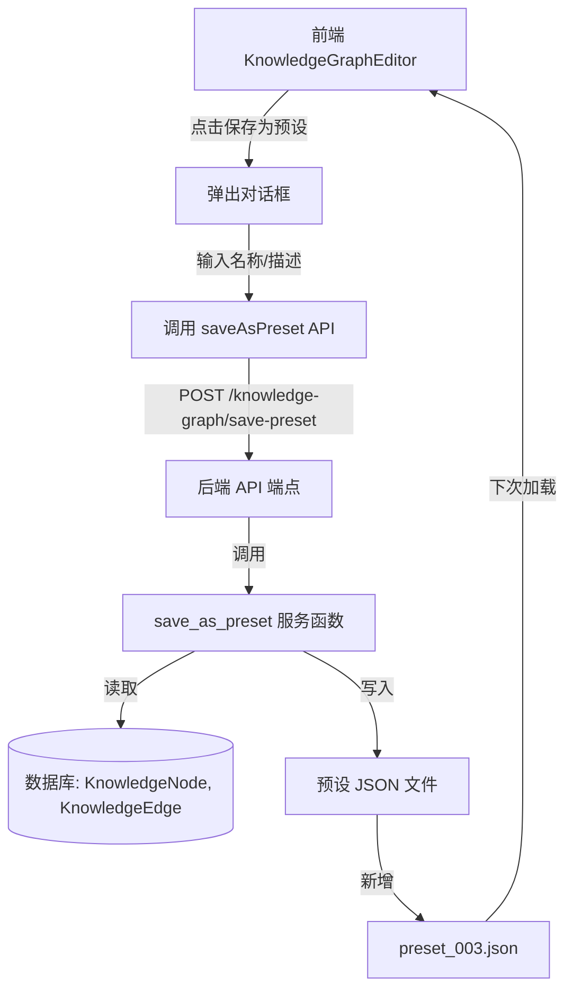

## 用户需求

用户希望在创建课程时，"预置知识图谱（可选）"下拉框里有更多选项，而不是永远只有两个。选择方案 B：在知识图谱编辑页面增加"保存为预设"功能，让用户可以把自己编辑的知识图谱保存为预设，这样创建课程时就能选择更多预设知识图谱。

## 功能内容

1. 在知识图谱编辑器（KnowledgeGraphEditor）中增加"保存为预设"按钮
2. 点击按钮后弹出对话框，输入预设名称和描述
3. 调用后端 API 将当前课程的知识图谱保存为新的 preset JSON 文件
4. 保存成功后，创建课程页面的下拉框会自动包含新预设（因为下拉框是从后端动态加载的）

## 视觉效果

- 在知识图谱编辑器的 header 区域增加一个"保存为预设"按钮
- 点击后弹出模态对话框，包含名称输入框、描述输入框、确认和取消按钮
- 保存过程中显示加载状态
- 保存成功后显示提示消息

## 技术栈

- 后端：Python + FastAPI（现有项目技术栈）
- 前端：Vue 3 + TypeScript + Element Plus（现有项目技术栈）

## 实现方案

### 后端实现

#### 1. `backend/app/service/knowledge_service.py` 新增 `save_as_preset()` 函数

**功能**：将某课程的知识图谱保存为预设 JSON 文件。

**实现逻辑**：

1. 从数据库读取指定 `course_id` 的所有 `KnowledgeNode` 和 `KnowledgeEdge`
2. 扫描 `_PRESETS_DIR` 目录下已有的 `preset_*.json` 文件，确定下一个 preset ID（最大 ID + 1）
3. 将 nodes 的 ID 重新从 1 开始编号（preset JSON 格式要求 sequential IDs）
4. 将 edges 中的 `source_node_id` 和 `target_node_id` 同步更新为重新编号后的 ID
5. 构建 preset JSON 结构（`id`, `name`, `description`, `nodes`, `edges`）
6. 写入新的 `preset_{id:03d}.json` 文件
7. 返回新 preset 的元数据（`id`, `name`, `node_count`, `edge_count`）

**关键考虑**：

- JSON 文件中的 node ID 必须从 1 开始连续编号，因为 `build_from_preset` 和 `_copy_template_nodes_to_course` 依赖这个假设来建立 ID 映射
- 需要确保 `_PRESETS_DIR` 目录存在，不存在则创建

#### 2. `backend/app/api/knowledge.py` 新增 API 端点

**新增端点**：`POST /knowledge-graph/save-preset`

**请求体**：

```
{
  "course_id": 1,
  "name": "预设名称",
  "description": "预设描述"
}
```

**响应**：

```
{
  "id": 3,
  "name": "预设名称",
  "node_count": 10,
  "edge_count": 15
}
```

**错误处理**：

- 如果课程不存在或没有知识节点，返回 400 错误
- 如果名称已存在，返回 409 错误

### 前端实现

#### 3. `frontend/src/api/knowledge.ts` 新增 API 函数

新增 `saveAsPreset()` 函数，调用 `POST /knowledge-graph/save-preset` API。

#### 4. `frontend/src/components/knowledge/KnowledgeGraphEditor.vue` 增加 UI

**修改内容**：

1. 在 header 区域增加"保存为预设"按钮
2. 增加响应式状态：`savingPreset`（保存中状态）、`presetName`、`presetDescription`、`showPresetDialog`（对话框显示状态）
3. 增加方法 `handleSaveAsPreset()`：调用 `saveAsPreset()` API，处理成功/失败
4. 在模板中增加模态对话框（使用简单的 div 模拟对话框，或使用 Element Plus 的 Dialog 组件）

**交互流程**：

1. 用户点击"保存为预设"按钮
2. 弹出对话框，输入预设名称和描述
3. 点击确认，调用 API
4. 成功后关闭对话框，显示成功消息
5. 用户可以继续编辑知识图谱

## 实现注意事项

### 性能考虑

- 保存预设是低频操作，性能要求不高
- 扫描现有 preset 文件时，文件数量很少（目前只有 2 个），性能不是问题
- 从数据库读取 nodes/edges 时，数据量通常不大（几十到几百个节点）

### 错误处理

- 后端：捕获文件写入错误、数据库查询错误，返回合适的 HTTP 状态码
- 前端：捕获 API 调用错误，显示用户友好的错误消息

### 安全性

- API 不需要特殊权限检查（任何用户都可以保存预设）
- 预设文件保存在服务器本地，不存在注入风险（JSON 序列化是安全的）

## 架构设计

### 系统架构图



### 数据流

1. 用户在知识图谱编辑器点击"保存为预设"
2. 输入预设名称和描述，点击确认
3. 前端调用 `saveAsPreset(courseId, name, description)` API
4. 后端 `save_as_preset()` 从数据库读取当前课程的所有 nodes/edges
5. 重新编号 node IDs，构建 preset JSON
6. 写入新的 `preset_{id:03d}.json` 文件
7. 返回新 preset 的元数据
8. 前端显示成功消息
9. 下次用户创建课程时，`listPresets()` 会自动包含新预设

## 目录结构

```
## 目录结构摘要
此实现为现有项目新增"保存为预设"功能。修改涉及后端服务层、API 层，以及前端 API 层和 UI 组件。

e:\2026hot\final\stip\
├── backend/
│   └── app/
│       ├── service/
│       │   └── knowledge_service.py  # [修改] 新增 save_as_preset() 函数。实现从数据库读取知识图谱、重新编号节点 ID、写入 preset JSON 文件的逻辑。
│       └── api/
│           └── knowledge.py           # [修改] 新增 POST /knowledge-graph/save-preset API 端点。定义请求/响应模型，调用 save_as_preset() 服务函数。
└── frontend/
    └── src/
        ├── api/
        │   └── knowledge.ts          # [修改] 新增 saveAsPreset() API 函数。调用后端 /knowledge-graph/save-preset 端点。
        └── components/
            └── knowledge/
                └── KnowledgeGraphEditor.vue  # [修改] 增加"保存为预设"按钮和对话框 UI。实现用户输入、API 调用、状态管理。
```

## 关键代码结构（可选）

### 后端服务函数签名

```python
def save_as_preset(
    course_id: int,
    name: str,
    description: str,
) -> dict[str, Any]:
    """
    将某课程的知识图谱保存为预设 JSON 文件。
    
    Args:
        course_id: 课程 ID
        name: 预设名称
        description: 预设描述
        
    Returns:
        新预设的元数据 (id, name, node_count, edge_count)
        
    Raises:
        ValueError: 如果课程不存在或没有知识节点
        OSError: 如果文件写入失败
    """
```

### 后端 API 请求/响应模型

```python
class SavePresetRequest(BaseModel):
    course_id: int
    name: str = Field(..., min_length=1, max_length=200)
    description: str = Field(default="")
```

### 前端 API 函数签名

```typescript
export interface SavePresetPayload {
  course_id: number
  name: string
  description?: string
}

export function saveAsPreset(payload: SavePresetPayload) {
  return http.post('/knowledge-graph/save-preset', payload)
}
```

## Agent Extensions

### SubAgent

- **code-explorer**
- Purpose: 在生成计划前，探索代码库以确认修改目标和现有模式
- Expected outcome: 确认 `_PRESETS_DIR` 路径是否正确、现有 preset JSON 格式、`save_as_preset()` 函数的最佳实现位置